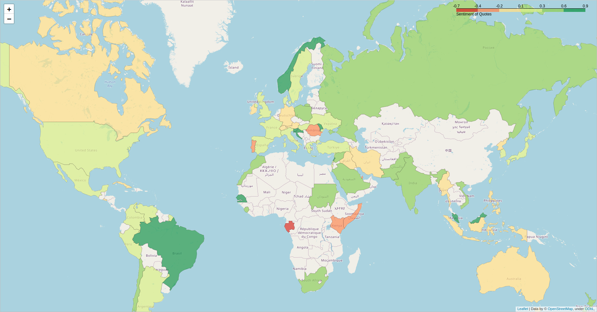

# ada-2021-project-young-boys

## Abstract
Nations around the world with different cultures and traditions have economic and political relationships with each 
other. Pew Research Center, a nonpartisan American fact tank that does not take policy positions, provides information 
about how the world feels about the United States. However, the number of countries is limited to thirty-seven. Our 
proposed project investigates only the quotations over five years to learn how other nations see a specific country. 
The dataset contains quotes from sources who are perceived to be biased in many issue areas. Thus, we identify factors 
that create those biases and eliminate them from our dataset to achieve comparable outcomes to the Pew Research Center 
for those thirty-seven countries. Consequently, we will estimate the favorability of the rest of the world towards the 
United States.

## Research Questions
###A. Do politicians and nonpoliticians say the same thing?
Politicians are biased in many issue areas, as interest groups or politicians themselves benefit from policies that harm
the public. In other words, politicians' opinions are different from nonpoliticians' opinions. We will perform the 
sentiment analysis on these two separate datasets. Then we study and compare the results to understand how politicians' 
options differ from nonpoliticians.

###B. Do the media reflect the nation?
As a society, we employ many different media and spend considerable time with media. We rely on it as a news source and 
entertainment, and we often assume that what we consume is pretty reliable. However, this assumption could not be 
accurate, as the media might be biased and has the tendency to lean towards or against someone or something. In most 
countries, media bias is thought to either lean to the left or right, favoring liberal or conservative politics. In some
countries, media bias can ultimately reflect the ideals of the governing body; for example, in North Korea, the media 
bias essentially becomes propaganda. Thus, we analyze the quotes given by cable news television channels or newspapers 
such as CNN, Fox News, The New York Times, etc.

###C. How does the world see the United States with a new president?
Europeans' attitudes toward the United States have undergone a massive change during Donald Trump's presidency. They 
thought that the United States' political was broken, furthermore European countries could not trust the United States 
to defend them. They tend to invest in their own economy and defense and look to Germany rather than the United States. 
They preferred to stay neutral in a conflict between the United States and China or Russia. Most Europeans rejoiced at 
Joe Biden's victory in the November 2020 US presidential election. Many people may have hoped that his victory election 
would have changed that dynamic. Still, the question is whether they believe that Biden can help the United States make 
a comeback as the pre-eminent global leader and positively impact their countries. At first, we intended to study the 
period before and after Joe Biden's presidency. However, the period right after an election might be pretty different 
from the middle of a United States president's presidency because the discussion is more about hopes and fears 
associated with the new president than about what the president has done politically. Thus, we consider the years of 
2015-16 and 2019-20 where there is a transition from Barack Obama to Donald Trump to analyze the changes in people's 
opinion towards the United States.

###D. How does the United States see the rest of the world?
According to Pew Research Center in 2013, Americans don't like Middle Eastern countries, and they don't like the United 
States. But there was one notable difference. The British don't have nearly the same affection for the United States as 
Americans have for Great Britain. In our proposed project, we will also compare the sentiments of countries about each 
other, e.g., see whether country 'A' likes country 'B' more than country 'B' likes country 'A'. We evaluate how the 
United States feels about the world and how the world thinks about the United States.

## Methods
### Countries quotes sentiment analysis
We considered the quoting bank from 2015 to 2020, which contains X quotes. We manually defined keywords "US," "U.S," 
"USA," and "United States," then extracted X quotes that contained these keywords. We identified the speaker nationality
of these quotes and performed a sentiment analysis. Sentiment analysis is a text analysis that determines polarity 
within the text. Finally, we study the positiveness or negativeness of the quotes of all countries towards the United 
States. 
You can find our preliminary results in the attachment.

### Investigation in sentiment analysis algorithms
We evaluated the accuracy of the sentiment analysis algorithm by conducting a user survey where fifty 
quotes were selected randomly, and different Python libraries named NLTK, Flair, and TextBlob were applied. As we 
observe in the Table below, the Flair library results in better sentiment analysis accuracy.

| | NLTK | TextBlob | Flair | 
|-------|:-------:|-------|-------| 
|Accuracy| X | X | X | 
|Time | X | X | X | 

### Keyword enrichment
To make our results of sentiment analysis more attractive and trustworthy, we will enrich the keywords. In our project, 
We extract all the American speakers using the "speaker_attributes.parquet" dataset, where we have the speaker and their 
nationality. Then, we filter the quotes that contain American names from 2015 to 2020.

### Estimate US favorability in unstudied countries using machine learning
## Organization within the team
| Research Questions | November | December |||
| :------------: | :-----------: | :-----------: | :-----------: | :-----------: |
| | Week 4 | Week 1 | Week 2 | Week 3 |
| A | Saleh | | | |
| B | | Alireza | | |
| C | | | Jonathan | |
| D | | | | Nicolas  |

